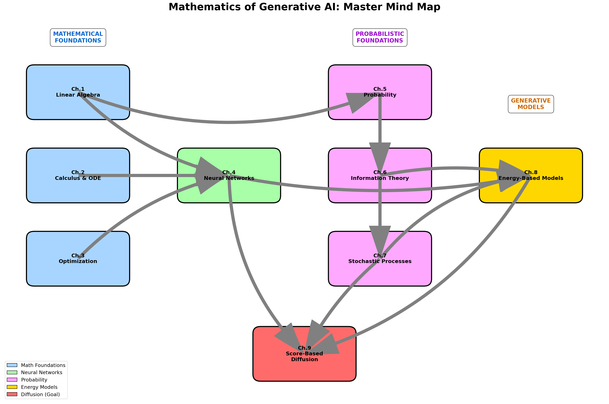
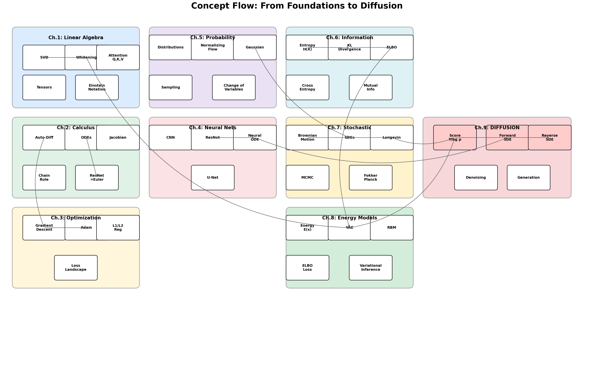
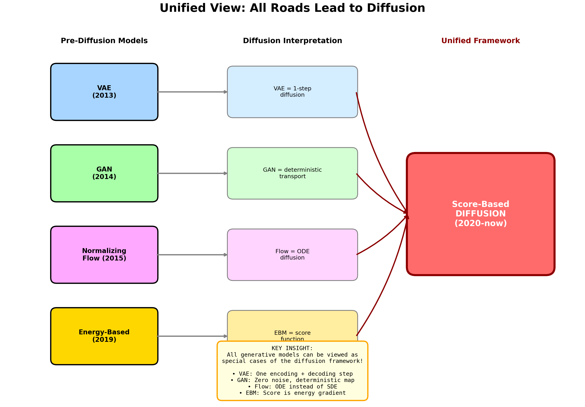
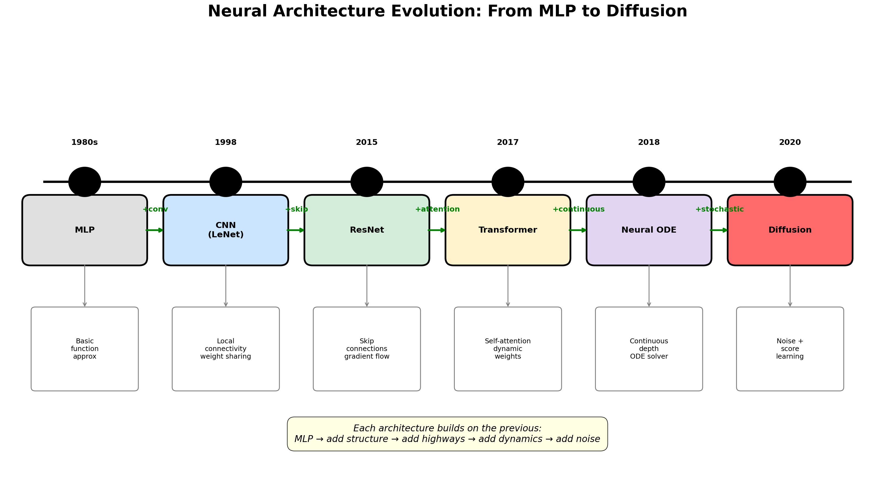
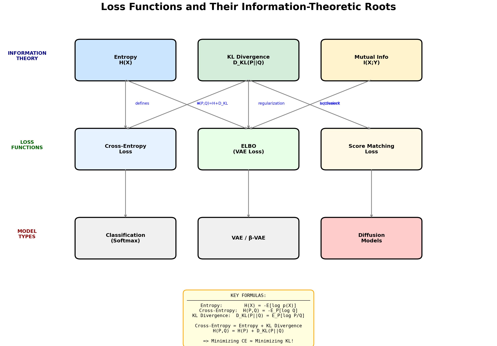
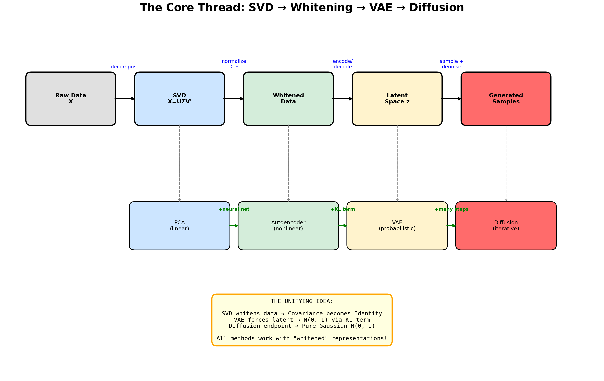
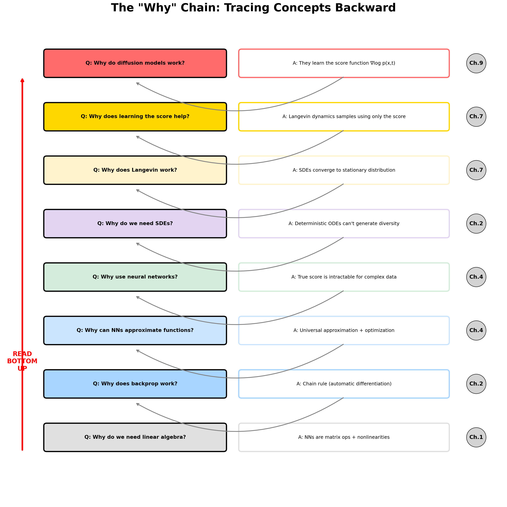

# Mathematics of Generative AI: Visual Mind Maps

> 이 문서는 책의 모든 개념들이 어떻게 연결되는지 시각적으로 보여줍니다.
>
> **이미지 파일 위치**: `mindmaps/` 폴더
> **재생성 방법**: `python3 generate_mindmaps.py`

---

## 1. Master Mind Map: 전체 구조

9개 챕터가 어떻게 연결되어 최종적으로 Diffusion으로 이어지는지 보여줍니다.



**핵심 포인트:**
- **파란색 (Ch.1-3)**: 수학적 기초 - Linear Algebra, Calculus, Optimization
- **초록색 (Ch.4)**: Neural Networks - 모든 것을 연결하는 중심
- **보라색 (Ch.5-7)**: 확률론적 기초 - Probability, Information Theory, Stochastic
- **노란색 (Ch.8)**: Energy-Based Models - VAE, RBM
- **빨간색 (Ch.9)**: Score-Based Diffusion - 최종 목표!

---

## 2. Concept Flow: 세부 개념 흐름

각 챕터 내의 개념들이 어떻게 다른 챕터의 개념들과 연결되는지 상세히 보여줍니다.



**주요 흐름:**
- `SVD → Whitening → VAE` (데이터 전처리의 진화)
- `ODE → ResNet → Neural ODE → Forward SDE` (연속 역학의 발전)
- `Entropy → KL → ELBO → VAE` (정보 이론에서 생성 모델로)
- `Brownian Motion → SDE → Langevin → Score` (확률 과정에서 Diffusion으로)

---

## 3. Unified View: 모든 길은 Diffusion으로

VAE, GAN, Flow, Energy-Based Model이 모두 Diffusion의 특수한 경우임을 보여줍니다.



**핵심 통찰:**
| Pre-Diffusion 모델 | Diffusion 관점에서의 해석 |
|-------------------|------------------------|
| VAE (2013) | 1-step diffusion (인코딩 + 디코딩) |
| GAN (2014) | Deterministic transport (노이즈 없음) |
| Normalizing Flow (2015) | ODE diffusion (SDE 대신 ODE) |
| Energy-Based (2019) | Score function = -∇E(x) |

---

## 4. Architecture Evolution: 아키텍처 진화

MLP에서 Diffusion까지 신경망 아키텍처의 발전 과정을 타임라인으로 보여줍니다.



**진화 단계:**
```
MLP (1980s)
  ↓ +convolution
CNN (1998)
  ↓ +skip connections
ResNet (2015)
  ↓ +attention / +continuous
Transformer (2017) ←→ Neural ODE (2018)
  ↓ +stochasticity (U-Net backbone)
Diffusion (2020)
```

---

## 5. Loss Functions: 손실 함수의 정보 이론적 뿌리

모든 손실 함수가 정보 이론에서 어떻게 유도되는지 보여줍니다.



**핵심 공식:**
```
Entropy:        H(X) = -E[log p(X)]
Cross-Entropy:  H(P,Q) = -E_P[log Q]
KL Divergence:  D_KL(P||Q) = E_P[log P/Q]

Cross-Entropy = Entropy + KL Divergence
    H(P,Q) = H(P) + D_KL(P||Q)

⟹ Cross-Entropy 최소화 ≈ KL Divergence 최소화!
```

---

## 6. SVD to Diffusion: 핵심 수학적 흐름

SVD에서 시작해서 Diffusion까지 이어지는 핵심 수학적 thread를 보여줍니다.



**통합 아이디어:**
```
SVD가 데이터를 whitening → Covariance가 Identity가 됨
VAE가 latent space를 강제 → N(0, I)로 (KL term으로)
Diffusion의 endpoint → 순수 Gaussian N(0, I)

⟹ 모든 방법이 "whitened" 표현으로 작동!
```

**방법론 진화:**
```
PCA (linear)
  → +neural net → Autoencoder (nonlinear)
  → +KL term → VAE (probabilistic)
  → +many steps → Diffusion (iterative)
```

---

## 7. The "Why" Chain: 개념의 논리적 연결

"왜?"라는 질문을 따라가며 개념들의 논리적 의존성을 추적합니다.



**아래에서 위로 읽으세요:**

| 질문 | 답변 | 챕터 |
|------|------|------|
| Q: 왜 선형대수가 필요한가? | A: NN은 행렬 연산 + 비선형성 | Ch.1 |
| Q: 왜 backprop이 작동하는가? | A: Chain rule (자동 미분) | Ch.2 |
| Q: 왜 NN이 함수를 근사할 수 있는가? | A: Universal approximation + 최적화 | Ch.4 |
| Q: 왜 NN을 사용하는가? | A: 진짜 score는 복잡한 데이터에서 계산 불가 | Ch.4 |
| Q: 왜 SDE가 필요한가? | A: 결정론적 ODE는 다양성 생성 불가 | Ch.2 |
| Q: 왜 Langevin이 작동하는가? | A: SDE가 정상 분포로 수렴 | Ch.7 |
| Q: 왜 score 학습이 도움이 되는가? | A: Langevin은 score만으로 샘플링 가능 | Ch.7 |
| Q: 왜 diffusion 모델이 작동하는가? | A: Score function ∇log p(x,t)를 학습 | Ch.9 |

---

## 마인드맵 재생성 방법

이미지를 수정하거나 재생성하려면:

```bash
# 저장소 루트에서 실행
python3 generate_mindmaps.py
```

필요한 패키지:
- `matplotlib`
- `numpy`

---

## 파일 목록

```
mindmaps/
├── 01_master_mindmap.png       # 전체 챕터 구조
├── 02_concept_flow.png         # 세부 개념 흐름
├── 03_unified_view.png         # 생성 모델 통합 관점
├── 04_architecture_evolution.png # 아키텍처 진화
├── 05_loss_functions.png       # 손실 함수와 정보 이론
├── 06_svd_to_diffusion.png     # SVD에서 Diffusion까지
└── 07_why_chain.png            # "왜?" 체인
```

---

*이 마인드맵들은 STUDY_GUIDE.md, NOTEBOOK_SEQUENCE.md, PROBLEM_SETS.md와 함께 사용하세요.*
