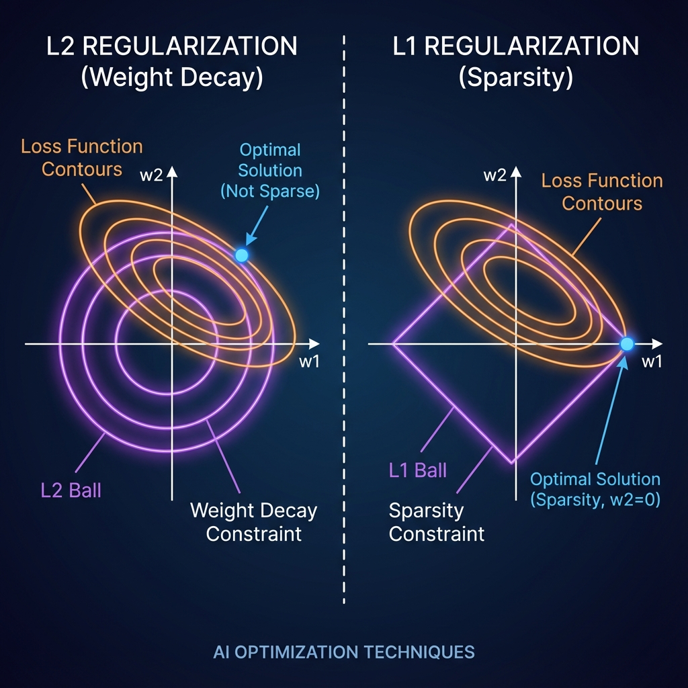

# Chapter 3: Optimization (in AI)

> **책 페이지**: 65-97
> **핵심 주제**: Gradient Descent, Convex/Non-Convex 최적화, Adaptive Methods, Regularization
> **KAIST Challenge 연결**: Challenge 5 (Optimization Landscapes), Challenge 6 (Tiny Transformers)

---

## 📚 목차

1. [최적화가 뭔가요?](#1-최적화가-뭔가요)
2. [Gradient Descent: 언덕 내려가기](#2-gradient-descent-언덕-내려가기)
3. [Convex vs Non-Convex: 쉬운 문제 vs 어려운 문제](#3-convex-vs-non-convex-쉬운-문제-vs-어려운-문제)
4. [SGD와 Momentum: 더 똑똑하게 내려가기](#4-sgd와-momentum-더-똑똑하게-내려가기)
5. [Adaptive Methods: Adam은 왜 잘 되나?](#5-adaptive-methods-adam은-왜-잘-되나)
6. [Regularization: 과적합 방지](#6-regularization-과적합-방지)
7. [Notebooks 가이드](#7-notebooks-가이드)
8. [Generative AI에서의 응용](#8-generative-ai에서의-응용)

---

## 1. 최적화가 뭔가요?

### 일상에서의 최적화

```
"서울에서 부산까지 가장 빨리 가는 방법?"
→ 여러 경로 중 최적을 찾는 것

"예산 100만원으로 가장 좋은 컴퓨터 조합?"
→ 제약 조건 하에서 최적을 찾는 것

"이 신경망의 정확도를 최대로 높이려면?"
→ AI에서의 최적화!
```

### AI에서 최적화 = "Loss를 최소화하는 파라미터 찾기"

신경망 학습의 본질:

1. 모델이 예측: $\hat{y} = f(x; W)$
2. 정답과 비교: $\text{Loss} = (y - \hat{y})^2$
3. Loss를 줄이는 $W$ 찾기!

**수학으로**:

$$W^* = \arg\min_W \text{Loss}(W)$$

→ "Loss를 최소로 만드는 $W$를 찾아라"

> **책 원문 (p.65):**
> "Optimization underpins most advances in Artificial Intelligence (AI). Whether training a Neural Network, fine-tuning a transformer, or building a generative diffusion model, optimization is at the heart."

### 왜 어려운가?

**간단한 경우**:
$\text{Loss} = W^2$ → 미분해서 0 놓으면 끝! $W^* = 0$

**신경망**:
$\text{Loss} = \text{복잡한 함수}(W_1, W_2, \ldots, W_{10억})$
- 수식으로 풀기 불가능!
- "조금씩 좋은 방향으로 이동"하는 방법 필요

---

## 2. Gradient Descent: 언덕 내려가기

### 기본 아이디어

```
산에서 길을 잃었다. 마을(골짜기)로 내려가고 싶다.
눈을 감고 있어서 전체 지형을 모른다.

전략: "발밑에서 가장 가파른 내리막 방향으로 한 발짝"
     → 이걸 계속 반복하면 골짜기에 도착!

이게 바로 Gradient Descent!
```

### 수학으로 표현

$$W_{\text{new}} = W_{\text{old}} - \eta \cdot \nabla \text{Loss}$$

| 기호 | 의미 |
|------|------|
| $\nabla \text{Loss}$ | Loss가 가장 빨리 **증가**하는 방향 (기울기) |
| $-\nabla \text{Loss}$ | Loss가 가장 빨리 **감소**하는 방향 |
| $\eta$ (에타) | 학습률 = "한 발짝의 크기" |

### 학습률(η)의 중요성

```
η가 너무 작으면:
    ↓
    ↓
    ↓
    ↓
    ↓ ... (영원히 내려가는 중...)
    최소점
→ 수렴은 하지만 너무 느림!

η가 너무 크면:
    ↓
         ↗
    ↙
         ↗  (튕겨다님)
    ↙
→ 수렴 못하고 발산!

η가 적당하면:
    ↓
      ↓
        ↓
         → 최소점
→ 빠르게 수렴!
```

### 1차원 예시로 이해하기

$\text{Loss}(w) = w^2$ (단순한 포물선), $w = 10$에서 시작, $\eta = 0.1$

| Step | $\nabla \text{Loss} = 2w$ | $w_{\text{new}} = w - \eta \cdot \nabla \text{Loss}$ |
|------|--------------------------|-----------------------------------------------------|
| 1 | $2 \times 10 = 20$ | $10 - 0.1 \times 20 = 8$ |
| 2 | $2 \times 8 = 16$ | $8 - 0.1 \times 16 = 6.4$ |
| 3 | $2 \times 6.4 = 12.8$ | $5.12$ |
| 4 | ... | $4.096$ |

→ 점점 0에 가까워짐! (최소점)

### Python 코드로 보기

```python
# 가장 단순한 Gradient Descent
w = 10.0  # 시작점
lr = 0.1  # 학습률

for step in range(20):
    grad = 2 * w           # Loss = w² 의 미분
    w = w - lr * grad      # 업데이트
    print(f"Step {step}: w = {w:.4f}")

# 출력: w가 점점 0에 가까워짐
```

### 💡 Advanced: GD를 ODE로 바라보기 (Gradient Flow)
챕터 2에서 배운 **미분방정식(ODE)**의 관점에서 GD를 보면 매우 흥미로운 사실을 알 수 있습니다.

1. **Gradient Flow (연속 시간)**:
   최적화를 "무한히 작은 걸음"으로 연속해서 이동한다고 생각하면, 파라미터 $W$의 변화는 다음과 같은 ODE로 표현됩니다.

   $$\dot{W} = \frac{dW}{dt} = -\nabla L$$

   이는 손실이라는 산에서 구슬이 골짜기로 굴러가는 **물리적 흐름**과 같습니다.

2. **Euler Method (이산화)**:
   컴퓨터는 연속 시간을 처리할 수 없으므로, 이 ODE를 짧은 간격($\eta$)으로 끊어서 계산합니다 (Euler Method).

   $$W_{t+1} = W_t - \eta \cdot \nabla L$$

   결국 **학습률($\eta$)은 ODE를 푸는 시간 간격(Step size)**이 됩니다!

> **왜 중요한가요?**
> - **Momentum**은 물리적으로 "질량"과 "관성"이 있는 2차 미분방정식($\ddot{W} + \gamma \dot{W} = -\nabla L$)으로 해석됩니다.
> - **학습률($\eta$)**이 너무 크면 발산하는 이유는, ODE를 풀 때 시간 간격(Step size)이 너무 커서 궤적을 벗어나기 때문입니다.

---

## 3. Convex vs Non-Convex: 쉬운 문제 vs 어려운 문제

### Convex (볼록) 함수 = 컵 모양

```
        Loss
        │
        │  \     /
        │   \   /
        │    \ /
        │     ●  ← 유일한 최소점
        └────────→ W

특징:
- 어디서 시작해도 같은 곳에 도착
- "지역 최소점 = 전역 최소점"
- 최적화가 쉬움!
```

**예시**: 선형 회귀의 MSE Loss

$$\text{Loss} = \sum_i (y_i - Wx_i)^2$$

→ $W$에 대해 볼록한 포물선 → Gradient Descent로 확실히 최적해 찾음

### Non-Convex (비볼록) 함수 = 울퉁불퉁한 산맥

```
        Loss
        │
        │ /\      /\
        │/  \    /  \
        │    \  /    \
        │     \/●     \
        └────────────→ W
             ↑
         지역 최소점들 여러 개!

특징:
- 시작점에 따라 다른 곳에 도착
- "지역 최소점 ≠ 전역 최소점" 일 수 있음
- 최적화가 어려움!
```

**예시**: 신경망의 Loss

$\text{Loss} = f(W_1, W_2, \ldots, W_{백만})$ → 수많은 지역 최소점 → 전역 최소점을 찾는다는 보장 없음

### 그럼 신경망은 왜 잘 학습되나?

```
다행히도:
1. "좋은" 지역 최소점이 많음
   → 전역 최소점 아니어도 성능 괜찮음

2. SGD의 노이즈가 도움
   → 나쁜 지역 최소점에서 탈출

3. Over-parameterization
   → 파라미터가 많으면 좋은 해가 많음
```

### Convex 판별법

2차 미분(Hessian)이 양정치: 모든 고유값 $\lambda_i > 0$ → Convex

직관적으로: "어느 방향으로 가도 위로 볼록하면 Convex"

### 💡 Lecture 2 Recap: 로지스틱 회귀의 Convexity
- **Question**: Cross-Entropy 손실을 사용하는 로지스틱 회귀는 Convex인가요?
- **Answer**: Yes! 로지스틱 회귀는 모델의 선형성/비선형성 여부와 상관없이 **Convex Optimization** 문제입니다. 이는 수렴 속도는 차이가 있을지언정, 항상 전역 최소점(Global Minima)에 도달할 수 있다는 강력한 보증을 제공합니다.
- **Golden Standard**: 신경망은 Non-convex하지만, 우리가 성공적으로 학습했을 때는 결국 효과적으로 Convex한 "분지(Basin)"에 도달한 것으로 이해할 수 있습니다.

---

## 4. SGD와 Momentum: 더 똑똑하게 내려가기

### 문제: 일반 GD는 느리다

데이터가 100만 개라면?

일반 GD: $\text{Loss} = \frac{1}{N} \sum_{i=1}^{N} \ell_i$ (모든 데이터의 오차 평균)

매 스텝마다 100만 개 전부 계산? → 한 스텝이 너무 오래 걸림!

### SGD (Stochastic Gradient Descent)

아이디어: "일부 데이터만 보고 대충 방향 잡자"

미니배치 (예: 32개)만 뽑아서:
$$\text{Loss}_{\text{batch}} = \frac{1}{B} \sum_{i \in \text{batch}} \ell_i$$

| 장점 | 단점 |
|------|------|
| 한 스텝이 빠름 | 방향이 부정확 (진동함) |
| 노이즈가 지역 최소점 탈출에 도움 | 수렴이 느릴 수 있음 |

### 비유: 술 취한 사람의 하산

```
GD (정신 멀쩡):
정확히 최단 경로로 내려감
→ 하지만 매 발걸음 신중하게 계산 (느림)

SGD (약간 취함):
대충 "아래쪽 같은 방향"으로 비틀비틀
→ 빠르게 많이 걸음
→ 가끔 이상한 데로 갔다가 돌아옴
→ 결국 도착은 함!
```

### Momentum: 관성 추가하기

문제: SGD가 지그재그로 진동함 (좌우로 왔다갔다)

해결: "이전에 가던 방향 기억해서 계속 밀자"

$$v_{\text{new}} = \beta \cdot v_{\text{old}} + \nabla \text{Loss} \quad \text{(관성 + 현재 기울기)}$$
$$W_{\text{new}} = W - \eta \cdot v_{\text{new}}$$

$\beta = 0.9$ 정도 (이전 방향의 90% 유지)

### Momentum의 효과

```
관성 없이 (SGD):
    →  ↓  →  ↓  →  ↓
       지그재그

관성 있으면 (Momentum):
    →→→→→→→→→
    좌우 진동이 상쇄되고, 아래 방향만 남음!
```

### Nesterov Momentum: 한 발 더

```
일반 Momentum:
"현재 위치에서 기울기 보고, 관성 더함"

Nesterov:
"관성대로 가 본 다음, 거기서 기울기 봄"

미리 가보고 판단 → 더 똑똑한 업데이트!
```

---

## 5. Adaptive Methods: Adam은 왜 잘 되나?

### 문제: 모든 파라미터에 같은 학습률?

```
신경망에는 다양한 파라미터가 있음:

Embedding["the"]:  매우 자주 업데이트됨
Embedding["serendipity"]:  거의 안 나옴

같은 η를 쓰면?
- "the": 너무 많이 업데이트 → 불안정
- "serendipity": 거의 안 배움 → 학습 부족
```

### AdaGrad: 각자 다른 학습률

아이디어: "지금까지 많이 업데이트된 애는 조금씩, 덜 업데이트된 애는 크게"

각 파라미터마다:
$$G = \sum_{t} g_t^2 \quad \text{(지금까지 기울기² 합계)}$$
$$\eta_{\text{실제}} = \frac{\eta}{\sqrt{G + \epsilon}}$$

- 많이 업데이트됨 → $G$ 큼 → $\eta_{\text{실제}}$ 작음
- 덜 업데이트됨 → $G$ 작음 → $\eta_{\text{실제}}$ 큼

### AdaGrad의 문제

$G$가 계속 커지기만 함! → 시간이 지나면 $\eta_{\text{실제}} \to 0$ → 학습이 멈춰버림...

해결책: "최근 기울기만 기억하자" → RMSProp

### RMSProp: 지수 이동 평균

$$G_{\text{new}} = \rho \cdot G_{\text{old}} + (1-\rho) \cdot g^2$$

($\rho = 0.9$ 정도)

- 옛날 기울기는 점점 잊혀짐
- $G$가 무한히 커지지 않음 → 학습이 계속 됨!

### Adam: RMSProp + Momentum + 보정

Adam = 현재 가장 많이 쓰이는 옵티마이저

| 모멘트 | 수식 | 의미 |
|--------|------|------|
| 1차 모멘트 $m$ | $m = \beta_1 m + (1-\beta_1) g$ | 기울기의 이동평균 (방향) |
| 2차 모멘트 $v$ | $v = \beta_2 v + (1-\beta_2) g^2$ | 기울기²의 이동평균 (크기) |

업데이트:
$$W = W - \eta \cdot \frac{\hat{m}}{\sqrt{\hat{v}} + \epsilon}$$

### Bias Correction이 뭔가요?

문제: 처음에 $m=0, v=0$으로 시작 → 초기 값들이 0 쪽으로 편향됨

해결:
$$\hat{m} = \frac{m}{1 - \beta_1^t}, \quad \hat{v} = \frac{v}{1 - \beta_2^t}$$

- $t$가 작을 때 (초기): 나누는 값이 작음 → 보정 효과 큼
- $t$가 클 때 (후기): 나누는 값 $\approx 1$ → 거의 안 바뀜

### 옵티마이저 비교 요약

| 옵티마이저 | 특징 | 언제 쓰나? |
|-----------|------|-----------|
| **SGD** | 단순, 일반화 좋음 | 충분한 시간 있을 때 |
| **SGD+Momentum** | 진동 감소 | SGD보다 빠르게 |
| **AdaGrad** | 희소 데이터에 좋음 | NLP 임베딩 |
| **RMSProp** | AdaGrad 개선 | RNN 학습 |
| **Adam** | 만능 | **대부분의 경우!** |

> **책 원문:**
> "Adam has become the de-facto standard optimizer in deep learning."

### 💡 Lecture 2 Recap: 최적화 알고리즘의 역사 (200년의 여정)
현대 AI에서 당연하게 쓰이는 Adam은 수많은 고전적 아이디어가 응축된 결과입니다:
1. **Cauchy (1847)**: 기본적인 Gradient Descent 도입.
2. **Polyak (1964)**: "Heavy Ball Method". 질량(Mass)과 관성(Momentum) 개념을 물리적 직관으로 도입. 진동을 억제하고 스무스하게 수렴하게 함.
3. **Nesterov (1983)**: 미래의 기울기를 미리 예측하여 움직이는 "Look-ahead" 모멘텀.
4. **Stochastic GD**: 모든 데이터가 아닌 배치(Batch)만 사용하여 연산 효율을 높이고 지역 최소점(Local Minima) 탈출 유도.
5. **Adaptive Methods (RMSProp/Adam)**: 파라미터별로 학습률을 다르게 조절(Adaptivity). **Adam**은 여기에 **Bias Correction**까지 더해 초기 불안정성을 해결했습니다.

---

## 6. Regularization: 과적합 방지

### 과적합이 뭔가요?

```
훈련 데이터:  ●  ●  ●  ●  ●

과적합 모델: ～～～～～～
            훈련 데이터에 딱 맞지만,
            새 데이터에서 엉망

좋은 모델:   ─────────
            조금 덜 맞지만,
            새 데이터에서도 OK
```

### 비유: 시험 공부

```
과적합 = "기출문제 답을 외움"
→ 똑같은 문제 나오면 100점
→ 조금만 바뀌면 0점

일반화 = "개념을 이해함"
→ 기출에서 90점
→ 새 문제에서도 85점
```

### L2 Regularization (Weight Decay)

**수식 (Math terms)**:
- **Loss**: $L_{total} = L_{data} + \frac{\lambda}{2} \|W\|_2^2$
- **Gradient**: $\nabla L_{total} = \nabla L_{data} + \lambda W$
- **Update**: $W_{new} = (1 - \eta \lambda) W - \eta \nabla L_{data}$

**효과**:
- **Weight Decay**: 매 스텝마다 가중치를 일정 비율($(1-\eta\lambda)$)로 감소시킵니다.
- 가중치가 너무 커지는 것을 방지하여 모델을 더 "부드럽게(Smooth)" 만듭니다.

### L1 Regularization (LASSO)

**수식 (Math terms)**:
- **Loss**: $L_{total} = L_{data} + \lambda \|W\|_1 = L_{data} + \lambda \sum |w_i|$
- **Gradient**: $\nabla L_{total} = \nabla L_{data} + \lambda \cdot \text{sign}(W)$
- **Update**: $W_{new} = W - \eta \nabla L_{data} - \eta \lambda \cdot \text{sign}(W)$

**효과**:
- **Sparsity**: 중요하지 않은 가중치를 **정확히 0**으로 만듭니다.
- **Feature Selection**: 자동으로 중요한 변수만 선택하는 효과가 있습니다.

### 기하학적 이해: 왜 L1만 0이 될까?

최적화 문제는 **"목표(Data Loss)와 제약(Regularization) 사이의 타협"**입니다.



1. **타협점(Tangency Point)**: 
   - 주황색 타원($L_{data}$)은 "데이터를 잘 맞추고 싶은 마음"입니다. 
   - 보라색 도형($L1, L2$ 영역)은 "가중치를 작게 유지하라는 규칙"입니다. 
   - 최적의 해는 주황색 타원이 보라색 도형과 **처음 만나는 접점**에서 형성됩니다.

2. **L2 (Circle)**: 
   - 제약 영역이 둥근 원형입니다. 
   - 타원이 원과 만날 때, 축(Axis) 위가 아닌 **어중간한 지점**에서 만날 확률이 높습니다. 
   - 따라서 가중치들이 아주 작아지긴 하지만, 정확히 0이 되지는 않습니다.

3. **L1 (Diamond)**: 
   - 제약 영역이 뾰족한 다이아몬드 형태입니다. 
   - 타원이 팽창하다가 다이아몬드와 만날 때, 보라색의 매끄러운 면보다는 **뾰족한 꼭짓점(Corner)**에 먼저 닿을 가능성이 압도적으로 높습니다.
   - **왜 꼭짓점인가?**: 꼭짓점에서는 한 파라미터(예: $w_1$)가 값을 가질 때 다른 파라미터($w_2$)는 정확히 0입니다. 이것이 바로 **Sparsity(희소성)**가 발생하는 수학적/기하학적 이유입니다.

> [!IMPORTANT]
> **왜 닿기 쉬운 걸 걱정해야 하나요?**
> 걱정하는 것이 아니라, 우리가 **의도하는 것**입니다! 
> 딥러닝 모델에서 수억 개의 파라미터 중 정말 중요한 것만 남기고 나머지를 0으로 만들고 싶을 때(모델 압축, 특징 추출), L1의 이 "뾰족한 꼭짓점" 성질을 이용하는 것입니다.

### 💡 Lecture 2 Recap: 왜 L1은 희소성(Sparsity)을 만드나?
Misha 교수는 **Compressed Sensing**의 핵심인 L1의 기하학적 의미를 '다이아몬드'로 설명했습니다.

- **The L1 Diamond**: L1 노름의 등고선은 축(Axis) 방향으로 뾰족한 다이아몬드(또는 고차원에서 Polytope) 모양입니다.
- **Corner Contact**: 우리가 예산(Constraint) 안에서 손실을 최소화하는 지점을 찾을 때, 이 뾰족한 다이아몬드의 '꼭짓점'에서 제약 조건과 만날 확률이 매우 높습니다.
- **Auto-Feature Selection**: 꼭짓점은 특정 좌표(가중치)가 정확히 0인 지점입니다. 따라서 L1은 "중요하지 않은 변수는 0으로 날려버리는" 강력한 희소성을 자연스럽게 유도합니다.

---

## 7. Notebooks 가이드

### Optimization/ 폴더

| 노트북 | 뭘 배우나? | 직접 해볼 것 |
|--------|-----------|-------------|
| `LogReg2D.ipynb` | 로지스틱 회귀 | 2D 분류 경계 시각화 |
| `LR-gradient-field.ipynb` | 기울기 벡터장 | Loss 지형 위에 화살표 |
| `Convex_vs_NonConvex_Landscapes.ipynb` | Convex vs Non-convex | 시작점 바꿔보기 |
| `adaptive.ipynb` | 옵티마이저 비교 | SGD/Adam/RMSProp 경쟁 |
| `adaptive_relu_2D.ipynb` | 신경망 + 옵티마이저 | Decision boundary 변화 |
| `tiny-transformer.ipynb` | 작은 Transformer | 시퀀스 학습 |
| `ImageRestoration_TV.ipynb` | Total Variation | 노이즈 제거 |

### 꼭 해볼 실험들

**1. 학습률 실험**
```python
# lr = 0.001, 0.01, 0.1, 1.0 으로 바꿔보기
# 너무 작으면? 너무 크면?
```

**2. 시작점 실험 (Non-convex)**
```python
# 같은 문제, 다른 초기값
# → 다른 최소점에 도착하는지 확인
```

**3. 옵티마이저 경쟁**
```python
# SGD vs Adam 학습 곡선 비교
# Adam이 왜 빠른지 관찰
```

---

## 8. Generative AI에서의 응용

### Transformer 학습: 왜 Adam + Warmup?

```
Transformer 특징:
- 파라미터 수억~수천억 개
- Attention, FFN, Embedding 각각 스케일 다름
- 초기에 기울기가 매우 불안정

Adam이 좋은 이유:
- 각 파라미터별로 적응적 학습률
- Momentum으로 방향 안정화
- Bias correction으로 초기 안정화

Warmup이 필요한 이유:
초기:  η = 0 → η_max (천천히 증가)
이후:  η_max → 0 (천천히 감소)

"처음엔 조심히, 나중엔 미세 조정"
```

### Diffusion Model 학습

$$\text{Loss} = \mathbb{E}\left[\|\epsilon - \epsilon_\theta(x_t, t)\|^2\right]$$

("노이즈 예측 오차의 평균")

**전형적인 설정**:
- Adam ($\beta_1=0.9, \beta_2=0.999$)
- $\text{lr} = 10^{-4} \sim 2 \times 10^{-4}$
- Warmup + Cosine decay
- EMA (Exponential Moving Average) of weights

U-Net 파라미터: 수천만~수억 개 → First-order method 필수

### GAN 학습: 왜 어려운가?

GAN = Generator vs Discriminator 게임

$$\min_G \max_D V(D, G)$$

**문제**:
1. 두 네트워크가 번갈아 학습
2. 한쪽이 너무 잘하면 다른쪽 학습 안 됨
3. Mode collapse: 다양성 사라짐

**해결책들**:
- Two-timescale: G와 D에 다른 학습률
- Spectral Normalization: 가중치 스케일 제한
- R1 Regularization: D의 기울기에 벌점

### LoRA: 효율적 파인튜닝

문제: GPT-3 파라미터 1750억 개 전부 학습? → 메모리, 시간 불가능

**LoRA 아이디어**:
$$W_{\text{new}} = W_{\text{frozen}} + \Delta W, \quad \Delta W = AB \text{ (low-rank!)}$$

| 방법 | 파라미터 수 |
|------|------------|
| 원래 | $1000 \times 1000 = 10^6$ |
| LoRA ($r=4$) | $1000 \times 4 + 4 \times 1000 = 8000$ |

→ 99% 이상 절약하면서 비슷한 성능!

### 💡 Lecture 2 Recap: 신경망의 진화와 AI Winter
1. **Perceptron (1950s-60s)**: 단순 선형 모델. XOR 문제(비선형 분리)를 풀지 못한다는 수학적 증명 이후 첫 번째 **AI Winter**가 찾아왔습니다.
2. **Multi-layer era**: 층을 더 쌓으면 비선형 분리가 가능하다는 사실을 알게 되었지만, 학습이 매우 어려웠습니다.
3. **AlexNet (2012)**: 힌튼(Hinton) 교수팀이 거대한 데이터를 **CNN**과 **GPU**를 사용하여 학습시키며 혁명을 일으켰습니다. (Sutskever, Krizhevsky가 핵심 주역)
4. **ResNet (2015)**: 스킵 커넥션(Skip Connections)의 도입. 이는 데이터를 단순히 변환하는 것이 아니라, ODE를 적분하듯 "작은 변화를 누적"하는 방식으로 깊은 층에서도 학습이 가능하게 했습니다.

---

## 📝 핵심 정리

### 이 챕터에서 꼭 기억할 것

1. **Gradient Descent = 기울기 반대로 이동**
   - 학습률이 중요 (너무 크지도, 작지도 않게)

2. **Convex면 쉽고, Non-convex면 어렵다**
   - 신경망은 Non-convex지만 의외로 잘 됨

3. **SGD는 빠르지만 진동, Momentum이 도움**
   - 관성으로 진동 줄이고 빠르게 수렴

4. **Adam = 현재 표준**
   - 적응적 학습률 + Momentum + 보정
   - 대부분의 경우 이걸로 시작

5. **Regularization = 과적합 방지**
   - L2: 가중치 작게
   - L1: 가중치 희소하게

---

## 🔗 다른 챕터와의 연결

| 연결 | 설명 |
|------|------|
| **Ch.2 → Ch.3** | GD = ODE의 이산화: $\dot{W} = -\nabla L$ |
| **Ch.3 → Ch.4** | 신경망 학습 = Non-convex 최적화, Perceptron에서 ResNet(ODE)으로의 진화 |
| **Ch.3 → Ch.6** | KL Divergence 최소화 |
| **Ch.3 → Ch.7** | SGD 노이즈 ≈ Langevin dynamics |

---

## 📊 KAIST Challenge 연결

### Challenge 5: Optimization Landscapes
```
질문: Convex에서 왜 모든 경로가 같은 점으로?
답: 지역 최소점 = 전역 최소점이 유일하니까!

질문: Non-convex에서 초기화가 왜 중요?
답: 시작점이 어느 "basin"에 있느냐에 따라
    도착하는 지역 최소점이 다르니까!
```

### Challenge 6: Tiny Transformer
```
질문: RMSProp이 가끔 정체되는 이유?
답: 초기에 큰 기울기 → v가 커짐
    → 이후에도 v가 계속 큼 → 업데이트 작음

질문: Adam은 왜 회복하나?
답: Bias correction + Momentum이
    초기 불안정을 보정해줌
```

---

*이 문서는 Mathematics of Generative AI Book Chapter 3의 학습 가이드입니다.*
